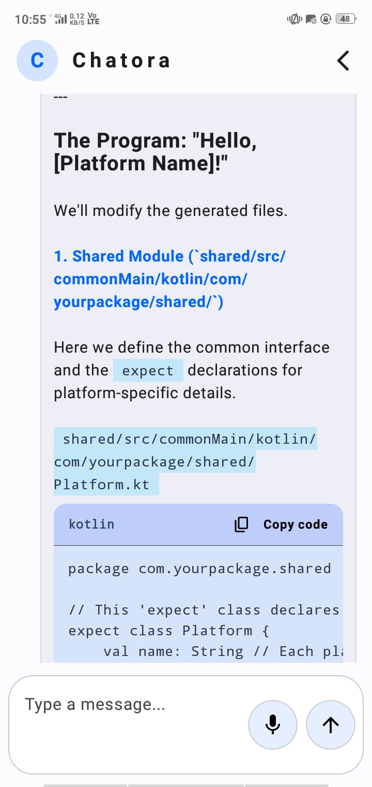
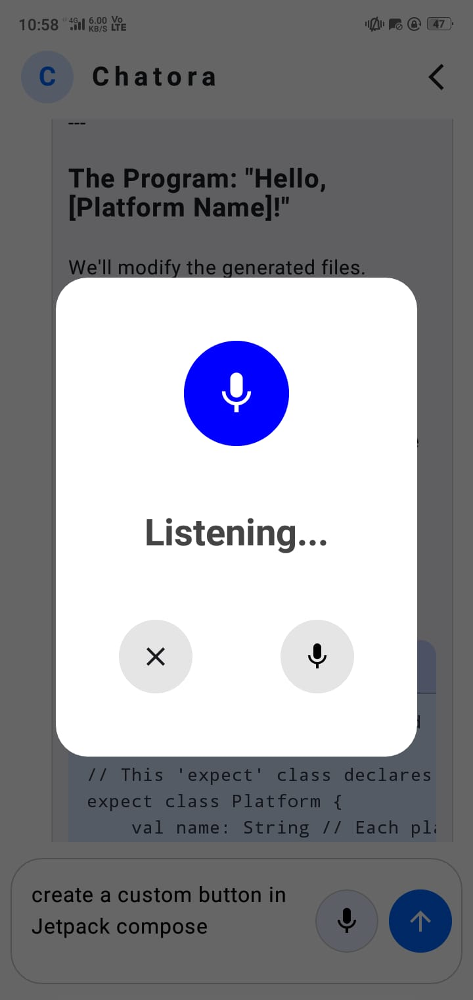

# Chatora
Chatora is a smart chatbot app that lets you chat, ask questions, and interact naturally with AI. With a sleek modern UI and powerful features like speech‑to‑text and stored chat history, it makes conversations seamless and accessible. 

## 📱 Screenshots

| Home Screen | Speak-to-Text Dialog |
|-------------|------------------|
|  |  |

## ✨ Features
- 💬 Smart Conversations: Chat and ask any questions with AI assistance.

- 🎙️ Speak‑to‑Text: Talk naturally and convert speech into text instantly.

- 🗂️ Chat History: All conversations stored locally using Room database.

- 🎨 Modern UI: Clean Jetpack Compose design for smooth user experience.

- 🌐 Powered by Gemini API: Free developer API integration for intelligent responses.

## 🛠️ Tech Stack
- Frontend: Kotlin + Jetpack Compose

- Architecture: MVVM with modular design

- Database: Room (for chat history storage)

- Backend/AI: Gemini Free Developer API

## 📜 License
This project is licensed under the MIT License — feel free to use and adapt with attribution.

## 🙏 Acknowledgements

- Thanks to the open‑source community for tools and libraries.
